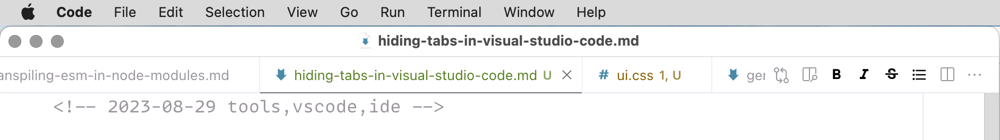
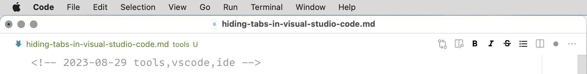
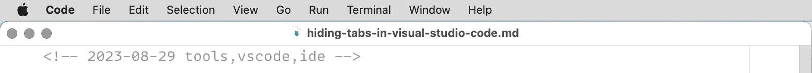

<!-- 2023-08-30 tools,vscode,ide -->

# Hiding tabs completely in Visual Studio Code

_I always disable tabs in code editors because they distract me._

By default Visual Studio Code shows tabs like this:



We could disable the tabs in settings:

```json
{
  "workbench.editor.showTabs": false
}
```

However, now instead of tabs there’s a bar with a file name that looks like one long tab and takes the same amount of space:



Unfortunately, [it’s impossible to hide it](https://github.com/Microsoft/vscode/issues/33607) without any hacks.

The only way to do it is by using the [Custom CSS and JS Loader](https://marketplace.visualstudio.com/items?itemName=be5invis.vscode-custom-css) extension:

1. Install the extension.
2. Create a CSS file with the following:

```css
.title.show-file-icons {
  display: none !important;
}
```

3. Add the following to the Code config file:

```json
{
  "vscode_custom_css.imports": [
    "file:///Users/username/path/to/the/css-file.css"
  ]
}
```

4. Open the command palette (Cmd+Shift+P), and select **Reload Custom CSS and JS**.

Finally, there are no distractions:



_I found this solution [in this GitHub comment](https://github.com/Microsoft/vscode/issues/33607#issuecomment-424193133)._
